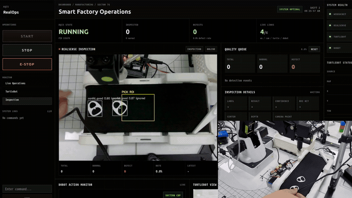

# SSAFY 15th · Gwangju Class 4, Team 3

> AI, Robotics, Web를 연결해 실제 장비가 움직이는 통합 시스템을 만듭니다.

SSAFY 15기 광주 4반 3조의 프로젝트 조직입니다. 2인 팀이 문제 정의부터 AI 모델, 디지털 트윈, 로봇 연동, 실시간 웹 관제까지 하나의 제품 흐름으로 구현했습니다.

## Featured Project

### [AQIS for SmartFactory](https://github.com/SSAFY-15th-HK/AQIS-for-SmartFactory)

**AI Quality Inspection System** — 캔 뚜껑의 불량 검사, 로봇 분류, 이동 로봇 상태, 실시간 모니터링을 연결한 디지털 트윈 기반 스마트팩토리 시스템입니다.

<p align="center">
  <a href="https://github.com/SSAFY-15th-HK/AQIS-for-SmartFactory">
    
  </a>
</p>

```text
RealSense + YOLO 검사 → 컨베이어 정지 → Dobot Pick & Place
→ ROS2 + FastAPI 통합 → React RealOps Dashboard
```

| 구분 | 내용 |
|---|---|
| 문제 | 실제 검사·로봇 분류·관제와 디지털 트윈 운반 시나리오를 하나의 프로젝트로 설계 |
| 접근 | mock-first 구조와 RoboDK 디지털 트윈으로 선개발 후 실제 장비 확장 |
| 구현 | YOLO+depth 검사, 컨베이어 제어, Dobot 작업, TurtleBot/SLAM 모니터링, 실시간 웹 관제 |
| 기술 | ROS2, YOLOv5, RealSense, Dobot, TurtleBot3, FastAPI, WebSocket, React, Three.js, RoboDK |
| 기간 | 2026.06 · 4주 · 초기 기획 2026.05 |

[프로젝트 README](https://github.com/SSAFY-15th-HK/AQIS-for-SmartFactory#readme) · [실행 가이드](https://github.com/SSAFY-15th-HK/AQIS-for-SmartFactory/blob/main/docs/real-hardware-startup.md) · [소스 코드](https://github.com/SSAFY-15th-HK/AQIS-for-SmartFactory)

## What We Built

- **Computer Vision** — RealSense 영상, YOLOv5 검출, ROI, depth 기반 3D 위치
- **Robot Integration** — 컨베이어 정지와 Dobot suction Pick & Place
- **Digital Twin** — RoboDK 기반 검사·분류·운반 공정
- **Realtime Web** — ROS2–FastAPI–WebSocket–React 통합 관제
- **Mobile Robot** — TurtleBot 카메라·pose·map·SLAM 모니터링
- **LLM Commands** — 텍스트 명령 의도 분류와 안전 키워드 fallback

## Team

| Member | Role | Contribution |
|---|---|---|
| [공세민](https://github.com/SeMinKong) | Team Lead · Full-stack / Robot Integration | RealOps Dashboard, FastAPI, ROS2 bridge, 컨베이어·Dobot·LLM 연동 |
| [현은빈](https://github.com/eunbin-hyun) | Simulation / AI / 3D | Simulation Dashboard, RoboDK, 3D 설계, Roboflow 데이터, YOLO 학습 |

## How We Work

- 실제 장비를 기다리지 않고 mock과 simulation으로 인터페이스를 먼저 검증합니다.
- 초기 목표와 실제로 구현·검증한 결과를 구분해 문서화합니다.
- AI, 로봇, 서버, UI를 기능별 저장소로 분리하기보다 하나의 재현 가능한 시스템으로 관리합니다.

## Contact

프로젝트 관련 문의와 피드백은 [AQIS Issues](https://github.com/SSAFY-15th-HK/AQIS-for-SmartFactory/issues)를 이용해 주세요.
